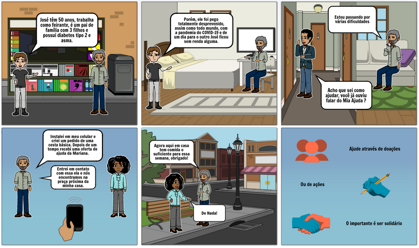
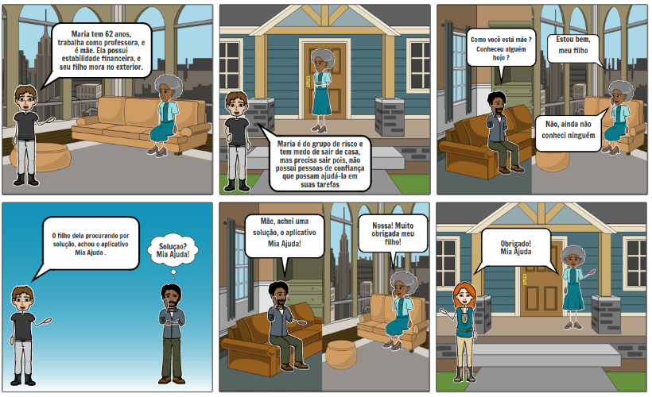

# Storytelling

## Introdução

- Storytelling é uma técnica de criação de narrativas, que também, pode ser utilizada para que o engenheiro de software identifique o público alvo de seu projeto, qual é o problema que deve ser resolvido e como ele pode ser resolvido. Dessa forma pode ser elicitar os requisitos do software

## Histórias

|Persona|Dados|
|:-:|:-:|
|Nome|José|
|Idade|50|
|Profissão|Feirante|
|Doença|Diabetes tipo 2 e Asma|

### História de José

José têm 50 anos, trabalha como feirante, é um pai de família com 3 filhos e possui diabetes tipo 2 e asma. Sua situação financeira nunca foi muito boa, mas José sempre conseguiu pagar suas contas, comprar comida pra casa e bancar o estudo dos filhos. Porém, ele foi pego totalmente desprevenido, assim como todo mundo, com a pandemia do COVID-19 e de um dia para o outro José ficou sem renda alguma.

As dívidas de José  começam a se acumular e o dinheiro do auxílio emergencial ainda não foi liberado. Por ser do grupo de risco, José tem muito medo de sair de casa, contrair o novo coronavírus e terminar  internado na UTI ou até vir a óbito.

Um dia estava em casa conversando pelo telefone, com meu irmão Vitor, e comentei com ele como estavam difíceis as coisas na minha casa, quando, para minha surpresa, ele disse que ficou sabendo de um aplicativo que reúne pessoas que querem oferecer ajuda e pessoas que precisam de ajuda, e me recomendou o Mia Ajuda. Assim que terminamos nosso bate papo, eu instalei em meu celular e criei um pedido de uma cesta básica. Depois de um tempo recebi uma oferta de ajuda da Mariana. Entrei em contato com essa moça e nós encontramos na praça próxima da minha casa. Agora aqui em casa tem comida o suficiente para essa semana, não sei o que eu faria se não tivesse ficado sabendo do Mia Ajuda.

---

|Persona|Dados|
|:-:|:-:|
|Nome|Maria|
|Idade|62|
|Profissão|Professora|
|Doença| - |

### História de Maria

Maria tem 62 anos, trabalha como professora, é mãe 1 filho adulto de classe média. Ela possui estabilidade financeira, e seu filho mora no exterior. Com a pandemia de COVID-19, ela se encontrou sozinha e tendo que permanecer em isolamento social.

Maria é do grupo de risco e tem medo de sair de casa, mas precisa sair pois, também não tem muitas pessoas de confiança para poder fazer as tarefas de contato social por ela.

O filho de Maria costumava ligar todo dia preocupado com a mãe, pelo fato dela morar longe e ela ter que sair sempre que precisasse de algo. Ele sempre tenta convencer ela de conhecer gente de confiança que faça compras e transportes por ela, mas ela se nega a ter que conhecer gente nova. O filho dela procurando por solução, achou o aplicativo Mia Ajuda que a pessoa pode ser ajudada por pessoas e agentes sociais mais próximos da região. A mãe após muito esforço tentou usar o aplicativo. E achou o contato de alguns conhecidos da vizinhança, se familiarizando com pessoas que podem ajudá-la.

### Versionamento

|Data|Versão|Descrição|Autor|
|:--------:|:---:|:-------------------:|:-------------:|
|22/09/2020| 0.1 | Criação do documento| Danillo Souza |
|25/09/2020| 0.2 | Adicionada a Maria  | Matheus Amaral|
|27/09/2020| 0.3 | Adicionando storyboard do José  | Pedro Vítor de Salles Cella|
