# Questionário

Esse técnica é muito útil para se utilizar em um grande número de pessoas, com ela é possível analisarmos os tipos de usuário que utilizariam do software bem como fornece uma em larga escala diversas opiniões sendo elas pontuais e objetivas.

## Construção do Questionário

A construção do Questionário se deu através da criação de perguntas-chave, ou seja, perguntas que levam o usuário levam o usuário a um novo conjunto baseando-se em suas respostas anteriores, dessa forma obteve-se a construção do diagrama:

## Resultados

Foi criado um termo de uso, para explicar à aqueles que fariam o questionário sobre o que se tratava o objeto de estudo a ser avaliado, assim como uma breve explicação do que era o aplicativo e os objetivos e procedimentos que eles fariam durante as respostas, atentando que caso eles quisessem desistir de responder, não haveria nenhuma penalidade.

<!-- Termo de Uso -->

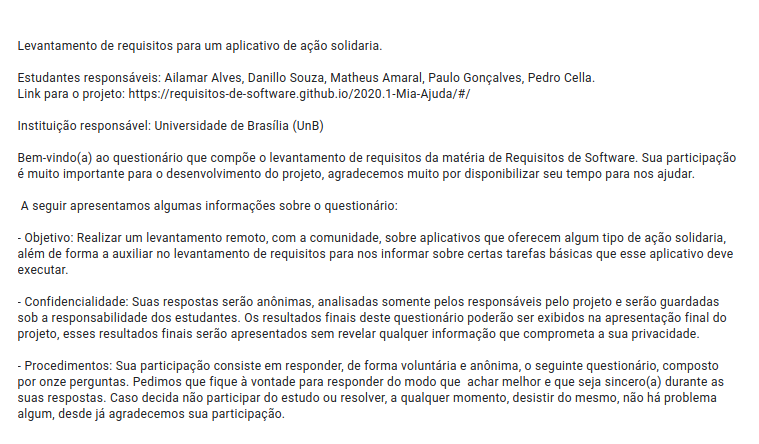

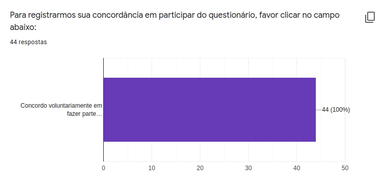

<!-- Sobre o usuário -->

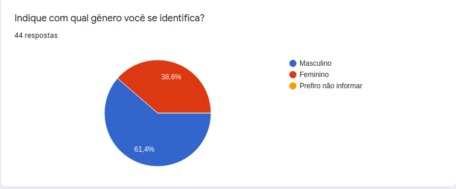

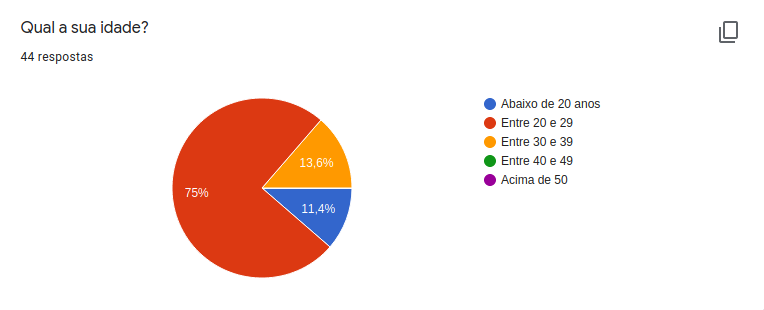

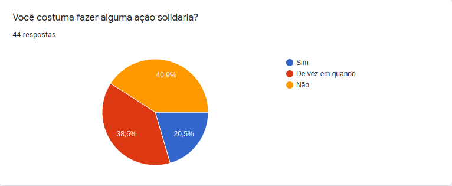

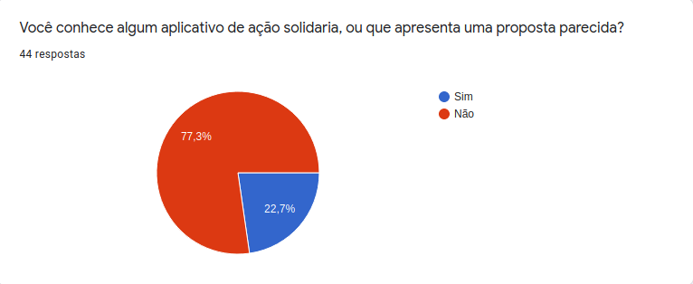

<!-- Sobre o aplicativo caso a pessoa conheca -->

### Caso a pessoa conheça um aplicativo

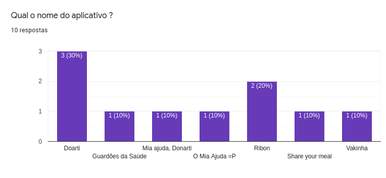

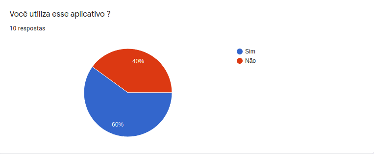

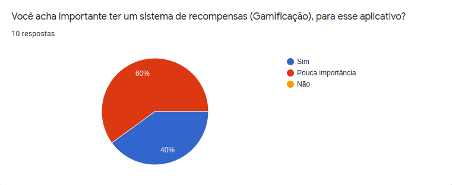

### Caso a pessoa utilize o aplicativo

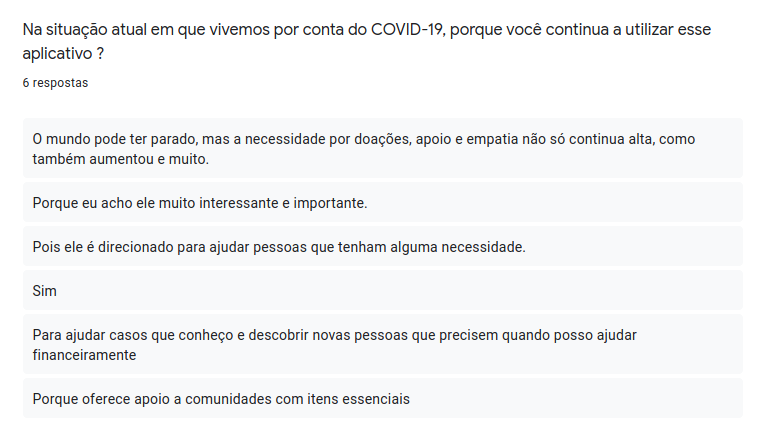

### Caso a pessoa não utilize o aplicativo

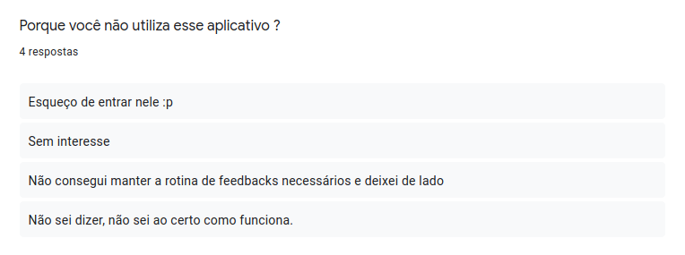

### Caso a pessoa não conheça um aplicativo

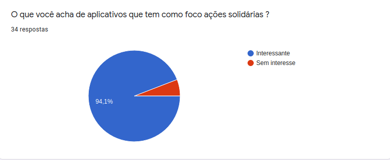

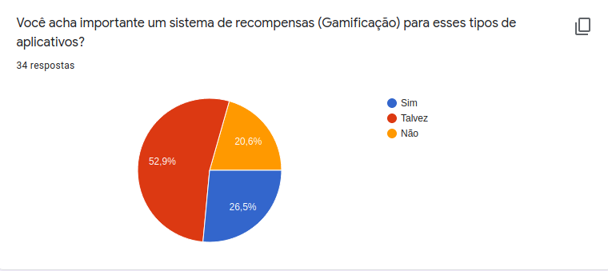

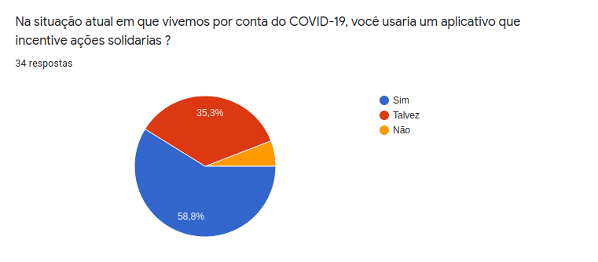

### Caso a pessoa ache interessante

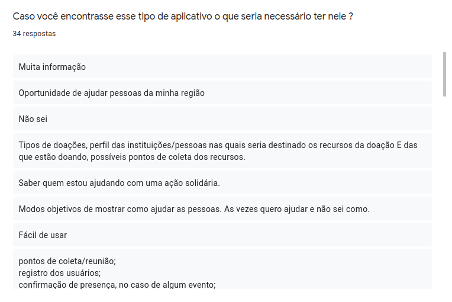

### Caso a pessoa não ache interessante

### Versionamento

|Data|Versão|Descrição|Autor|
|:--------:|:---:|:-------------------: |:-----------------------:|
|24/09/2020| 0.1 | Criação do documento | Pedro Vítor de Salles Cella |
|27/09/2020| 0.2 | Atualização do documento | Pedro Vítor de Salles Cella |

