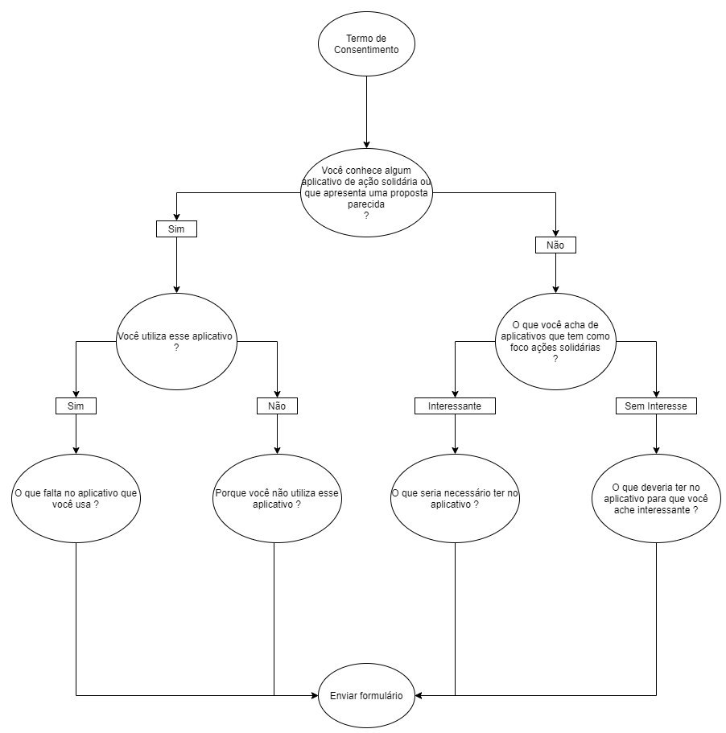

# Questionário

Esse técnica é muito útil para se utilizar em um grande número de pessoas, com ela é possível analisarmos os tipos de usuário que utilizariam do software bem como fornece uma em larga escala diversas opiniões sendo elas pontuais e objetivas.

### Construção do Questionário

A construção do Questionário se deu através da criação de perguntas-chave, ou seja, perguntas que levam o usuário levam o usuário a um novo conjunto baseando-se em suas respostas anteriores, dessa forma obteve-se a construção do diagrama:

### Resultados

### Versionamento

|Data|Versão|Descrição|Autor|
|:--------:|:---:|:-------------------: |:-----------------------:|
|24/09/2020| 0.1 | Criação do documento | Pedro Vítor de Salles Cella |
