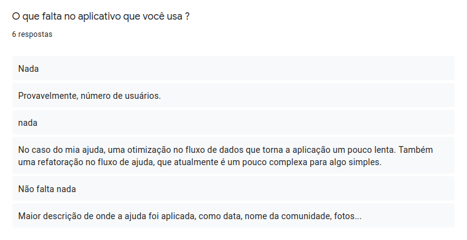

# Questionário

Esse técnica é muito útil para se utilizar em um grande número de pessoas, com ela é possível analisarmos os tipos de usuário que utilizariam do software bem como fornece uma em larga escala diversas opiniões sendo elas pontuais e objetivas.

## Construção do Questionário

A construção do Questionário se deu através da criação de perguntas-chave, ou seja, perguntas que levam o usuário levam o usuário a um novo conjunto baseando-se em suas respostas anteriores, dessa forma obteve-se a construção do diagrama:

## Perfil do Usuário

Através do questionário conseguimos obter também algumas características de perfil do usuário.

|Número|Perfil| 
|:--------:|:---------:|
|1|  A maioria das pessoas gostaria de um aplicativo de ação solidária durante o período da COVID19  |
|2| Grande parte dos usuários se interessam em aplicativos com foco em ação solidárias |
|3| A maioria das pessoas não conhecem um aplicativo de ação solidaria|

## Resultados

Foi criado um termo de uso, para explicar à aqueles que fariam o questionário sobre o que se tratava o objeto de estudo a ser avaliado, assim como uma breve explicação do que era o aplicativo e os objetivos e procedimentos que eles fariam durante as respostas, atentando que caso eles quisessem desistir de responder, não haveria nenhuma penalidade.

<!-- Termo de Uso -->

<!-- Sobre o usuário -->

<!-- Sobre o aplicativo caso a pessoa conheca -->

### Caso a pessoa conheça um aplicativo

### Caso a pessoa utilize o aplicativo

### Caso a pessoa não utilize o aplicativo

### Caso a pessoa não conheça um aplicativo

### Caso a pessoa ache interessante

### Caso a pessoa não ache interessante

### Resultados

|Número|Requisito| Priorização |
|:--------:|:---------:|:--------:|
|1| Seria  interessante ter um sistema de gameficação no aplicativo, mas não obrigatório  | Could |
|2| Facilidade de uso | Should |
|3| Modos objetivos de mostrar como ajudar as pessoas | Should |
|4| Ser leve, demandar poucos dados móveis e ser fácil de mexer | Would |
|5| Os usuários acharam que era necessário o aplicativo possuir um mapa que apresente focos de ações solidárias | Must |
|6| Os usuários acharam interessante ter uma espécie de feedback para a pessoa que doou | Should |
|7| Os usuários gostariam de uma identificação de ações solidárias que fossem próximas a eles | Should |
|8| Segurança, aparência e outras informações dos usuários, não expondo-as para o público em geral, a não ser a quem é necessário | Must |
|9| Gamificação (https://play.google.com/store/apps/details?id=cc.forestapp) , algum tipo de gamificação como esse aplicativo para os usuários, mas pensar como fazer isso de uma maneira correta | Would |
|10| O usuário gostaria de um maior detalhamento no campo de descrição da ajuda | Should |
|11| Ter uma forma de lembrar para o usuário que o aplicativo "Existe" | Should |
|12| Os usuários gostariam de saber mais informações sobre quem estaria sendo beneficiado pela ajuda | Must |

### Versionamento

|Data|Versão|Descrição|Autor|
|:--------:|:---:|:-------------------: |:-----------------------:|
|24/09/2020| 0.1 | Criação do documento | Pedro Vítor de Salles Cella |
|27/09/2020| 0.2 | Atualização do documento | Pedro Vítor de Salles Cella |
|29/09/2020| 0.3 | Adição dos requisitos | Pedro Vítor de Salles Cella |

