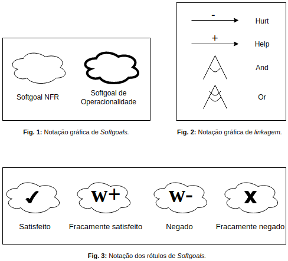
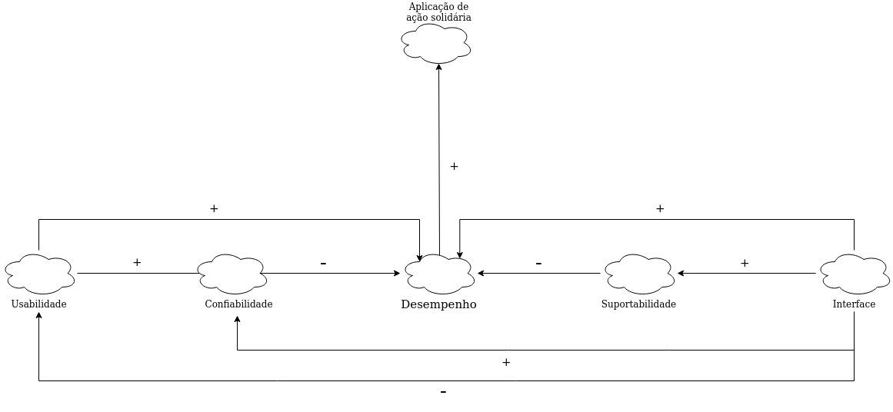
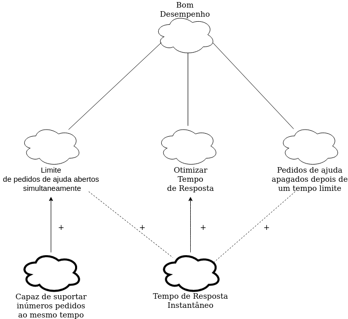
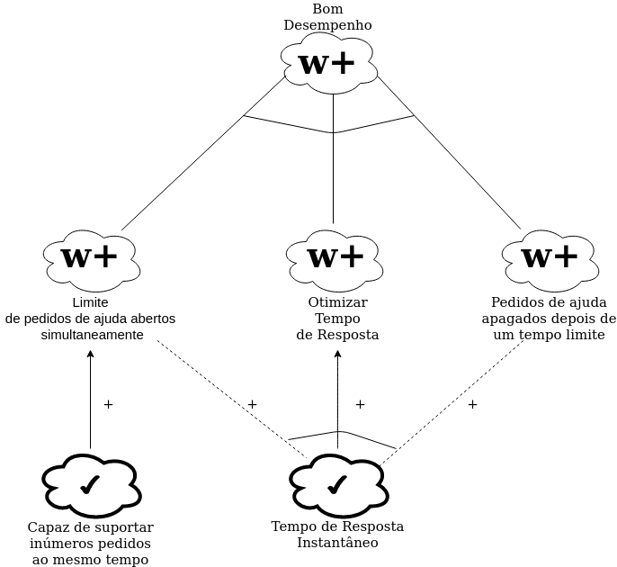
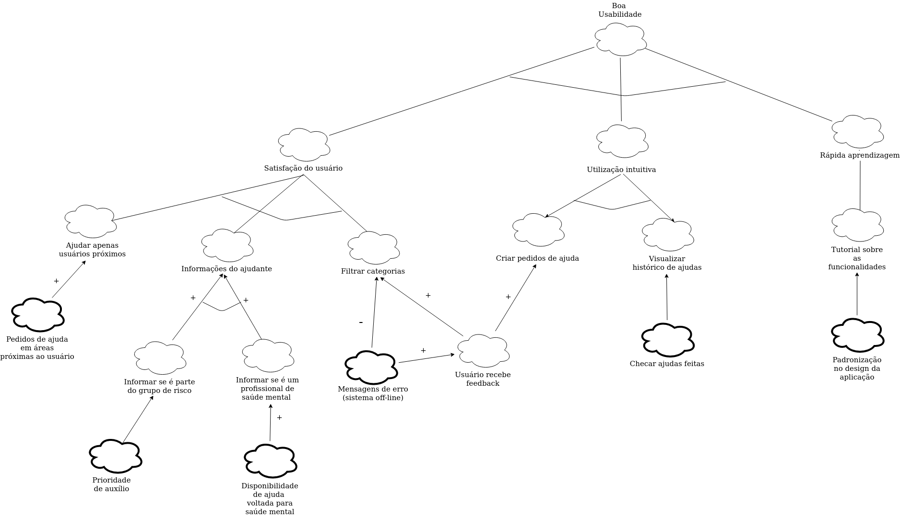
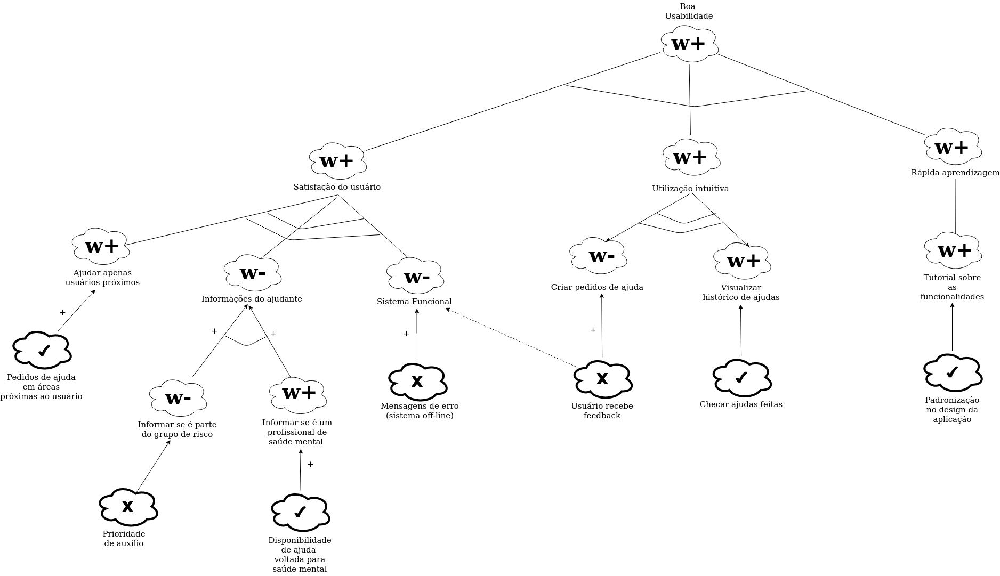
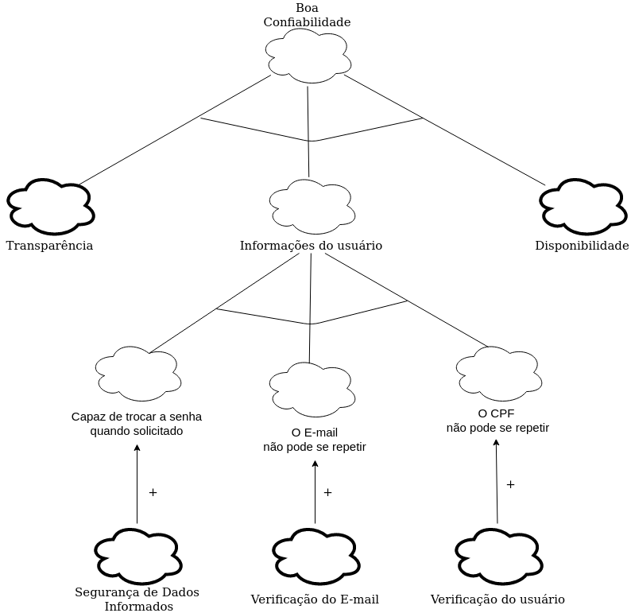
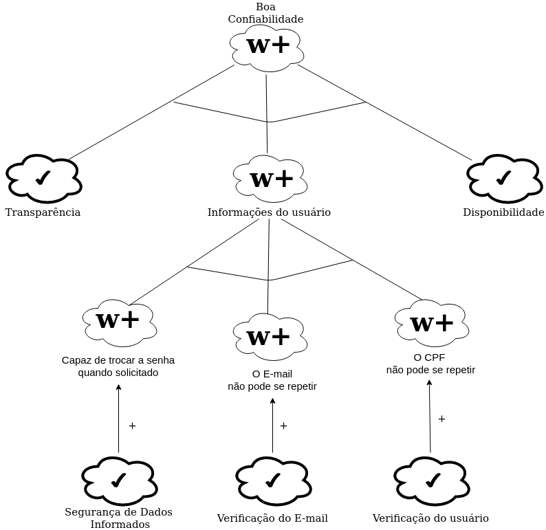

# NFR Framework

## Introdução

O NFR (Non-Functional Requirements) Framework trata-se de um framework conceitual para condução da Engenharia de Requisitos  com uma extensão que apoia suposições para avaliação de
satisfação das metas-flexíveis.  
Esse modelo foi criado por CHUNG (1995), e adota uma abordagem específica para o tratamento de Requisitos Não-Funcionais e fornece uma rica representação para expressar esses requisitos.

## Metodologia 

Como explicado acima, neste documento estamos focados nos Requisitos Não-Funcionais.
Para isso criamos uma abstração buscando atingir funcionalidades específicas, fazendo análise das possíveis situações, considerando as aplicações e tecnologias já pré-existentes no aplicativo Mia Ajuda.

## NFR's

Esses são os Requisitos não Funcionais levantados a partir da [Introspecção](https://requisitos-de-software.github.io/2020.1-Mia-Ajuda/#/pages/elicitations/introspection) que foram usados para criação do Framework:

|Número|Requisito|
|:-:|:-:|
|RNF-01|O usuário deve ser capaz de criar diversos pedidos de ajuda|
|RNF-02|O usuário deve ser capaz de ver as informações básicas de quem lhe ofereceu ajuda|
|RNF-03|O usuário deve ser capaz de visualizar seu histórico de ajudas|
|RNF-04|O usuário deve ser capaz de trocar sua senha quando solicitado|
|RNF-05|O usuário deve ser capaz de informar se faz parte do grupo de risco da COVID-19|
|RNF-06|O usuário deve ser capaz de informar que é um profissional da saúde mental|
|RNF-07|O usuário deve ser capaz de selecionar a categoria de sua ajuda para que a mesma possa ser filtrada por outros usuários|
|RNF-08|O E-mail do usuário não pode se repetir|
|RNF-09|O CPF do usuário não pode se repetir|
|RNF-10|O usuário deve receber notificações quando tiver uma oferta de ajuda aceita|
|RNF-11|O usuário deve ter um limite de pedidos de ajuda abertos simultaneamente|
|RNF-12|O E-mail do usuário deve ser validado ao criar uma nova conta|
|RNF-13|As ajudas do usuário devem ser apagadas depois de um tempo limite|
|RNF-14|Um usuário só pode ajudar outros usuários que estiverem dentro do seu raio de distância|
|RNF-15|Se deve avisar ao usuário caso o sistema esteja *offline* e ter uma estimativa de volta.||

## Modelagens NFR's

### Legendas

 

### NFR01 Geral

--- 

### NFR02 Desempenho

--- 

### NFR02 Propagação

--- 

### NFR03 Usabilidade

--- 

### NFR03 Propagação

--- 

### NFR04 Confiabilidade

--- 

### NFR04 Propagação

---

### Rastreabilidade

|NFR Geral|Descrição|
|:-:|:-:|
|Versão|0.1|
|Rastreabilidade|[Especificação Suplementar](https://requisitos-de-software.github.io/2020.1-Mia-Ajuda/#/pages/modeling/specification)   [Introspecção](https://requisitos-de-software.github.io/2020.1-Mia-Ajuda/#/pages/elicitations/introspection)|

 

Versionamento 

|Data|Versão|Descrição|Autor|
|:-:|:-:|:-:|:-:|
|16/10/2020|0.1|Criação do escopo do documento|Ailamar Alves|
|21/10/2020|0.2|Adição da lista de NFR e legendas|Ailamar Alves|
|26/10/2020|0.3|Adição das imagens do NFR|Pedro Vítor de Salles Cella|
|05/11/2020|0.4|Adição da rastreabilidade do NFR|Ailamar Alves e Pedro Vítor de Salles Cella|

 
Referências

- Requisitos - Modelagem. SERRANO, Milene; SERRANO, Maurício. Disponível em: <https://aprender3.unb.br/pluginfile.php/426768/mod_resource/content/1/Requisitos%20-%20Aula%20019a.pdf>. Acesso em: out 2020.
- Um Catálogo de Requisitos Não-Funcionais para Sistemas Embarcados. DA SILVA, Reinaldo Antônio. Diponível em: <https://aprender3.unb.br/pluginfile.php/573096/mod_resource/content/2/DISSERTA%C3%87%C3%83O%20Reinaldo%20Ant%C3%B4nio%20da%20Silva.pdf>. Acesso em: out 2020.
