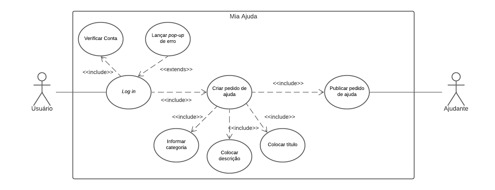
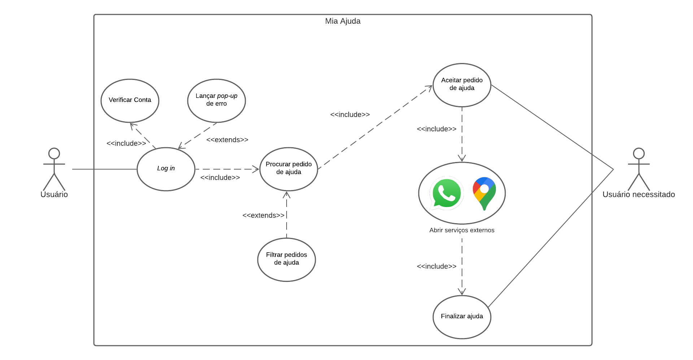
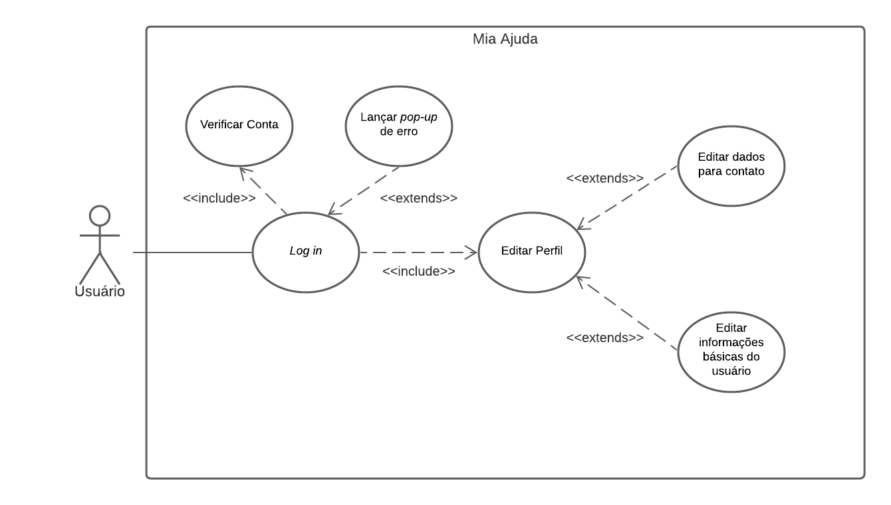
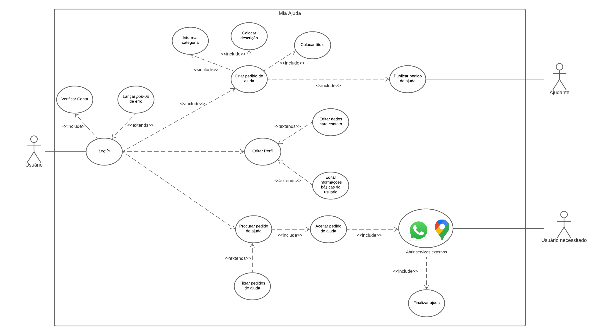

# Caso de Uso

O caso de uso é forma de modelagem que serve para ilustrar a ideia ou do software ou dos requisitos levantados, é uma ferramenta muito útil para podermos analisarmos de forma ilustrativa a ideia e o funcionamento do software, dessa forma fica mais claro como ele funciona, bem como possíveis erros que ele poderá ter. Essa ferramenta também é muito útil para se explicar à um cliente ou uma pessoa que não esteja envolvida na área de Tecnologia da Informação, o que torna esse método imprescindível para a parte de modelagem é o que foi supracitado antes que é a forma de se ilustrar ou criar um modelo físico do conceito e das ideias criadas do software.

# Diagramas de Casos de Uso

## Criar Pedido de Ajuda
Léxico - Item <i>Ajuda</i>

|Sigla|Descrição|
|:-:|:-|
|Versão|0.1|
|Autor|Pedro Vítor de Salles Cella|
|Descrição|Criação de um Pedido de Ajuda|
|Ator|Usuário Mia Ajuda Ajudante|
|Pré-condições|O usuário estar cadastrado no sistema|
|Fluxo Principal|- Acesso através do *log in* na conta - Criação de um pedido de ajuda - Publicação do pedido de ajuda e espera|
|Fluxo Alternativo||
|Fluxo de Exceções|**FE1 - O Usuário não possui uma conta no aplicativo**  - O Usuário deve criar uma conta utilizando E-mail e CPF |
|Pós Condições|Facilitação da criação do pedido de Ajuda|
|Rastreabilidade|Baseado no Requisito Funcional 2 - O usuário deve ser capaz de pedir ajuda para outros usuários|

## Aceitar pedido de Ajuda
Léxico - Itens <i>Abrir serviços externos, Filtrar pedidos de ajuda, Finalizar ajuda</i>

|Sigla|Descrição|
|:-:|:-|
|Versão|0.1|
|Autor|Pedro Vítor de Salles Cella|
|Descrição|O Ajudante aceita um pedido de ajuda|
|Ator|Ajudante Mia Ajuda Usuário|
|Pré-condições|O ajudante já deve ter cadastro no sistema|
|Fluxo Principal|- Acesso através do *log in* na conta - Pesquisa por pedidos de ajuda próximos - Aceita-se um pedido de ajuda - Finaliza o pedido cao concluído|
|Fluxo Alternativo|**FA1 - O Ajudante filtra os pedidos de ajuda** - Acesso através do *log in* na conta - O Ajudante filtra os tipos de ajuda que preferir  - Aceita-se o pedido de ajuda - Finaliza o pedido caso concluído|
|Fluxo de Exceções|**FE2 - Uso de Serviços Externos** - O aplicativo mostra uma mensagem para que seja aceito o uso de serviçoes externos|
|Pós Condições|O Ajudante pode visualizar suas ofertas de ajuda concluídas pelo seu histórico|
|Rastreabilidade|Baseados nos seguintes Requisitos Funcionais: - Requisito Funcional 3 - O usuário deve ser capaz de oferecer ajuda a outros usuários - Requisito Funcional 8 - O usuário deve ser capaz de finalizar uma oferta de ajuda após ajudar um usuário - Requisito Funcional 11 - O usuário deve ser capaz de visualizar suas ofertas de ajuda |

## Editar Perfil
Léxico - Item <i>Editar perfil</i>

|Sigla|Descrição|
|:-:|:-|
|Versão|0.1|
|Autor|Pedro Vítor de Salles Cella|
|Descrição|O Usuário poderá editar suas informações de perfil|
|Ator|Usuário Mia Ajuda|
|Pré-condições|O ajudante já deve ter cadastro no sistema|
|Fluxo Principal|- Acesso através do *log in* na conta - Edição do telefone indicado no perfil - Edição do endereço - Edição da foto de perfil|
|Fluxo Alternativo||
|Fluxo de Exceções||
|Pós Condições|O Usuário pode vizualizar suas informações salvas na próxima vez que acessar o aplicativo|
|Rastreabilidade|Baseados nos seguintes Requisitos Funcionais: - Requisito Funcional 15 - O usuário pode editar seu telefone - Requisito Funcional 16 - O usuário pode editar seu endereço - Requisito Funcional 17 - O usuário pode editar sua foto de perfil|

## Diagrama Geral

## Versionamento

|Data|Versão|Descrição|Autor|
|:--------:|:---:|:-------------------: |:-----------------------:|
|06/10/2020| 0.1 | Criação do documento | Pedro Vítor de Salles Cella |
|07/10/2020| 0.2 | Atualização do documento | Pedro Vítor de Salles Cella |
|04/11/2020| 0.3 | Tabelas de Descrição dos diagramas | Pedro Vítor de Salles Cella |

## Referências
[Página e Use Case do Audible ](https://requisitos-de-software.github.io/2019.2-Audible/casos_de_uso/)
