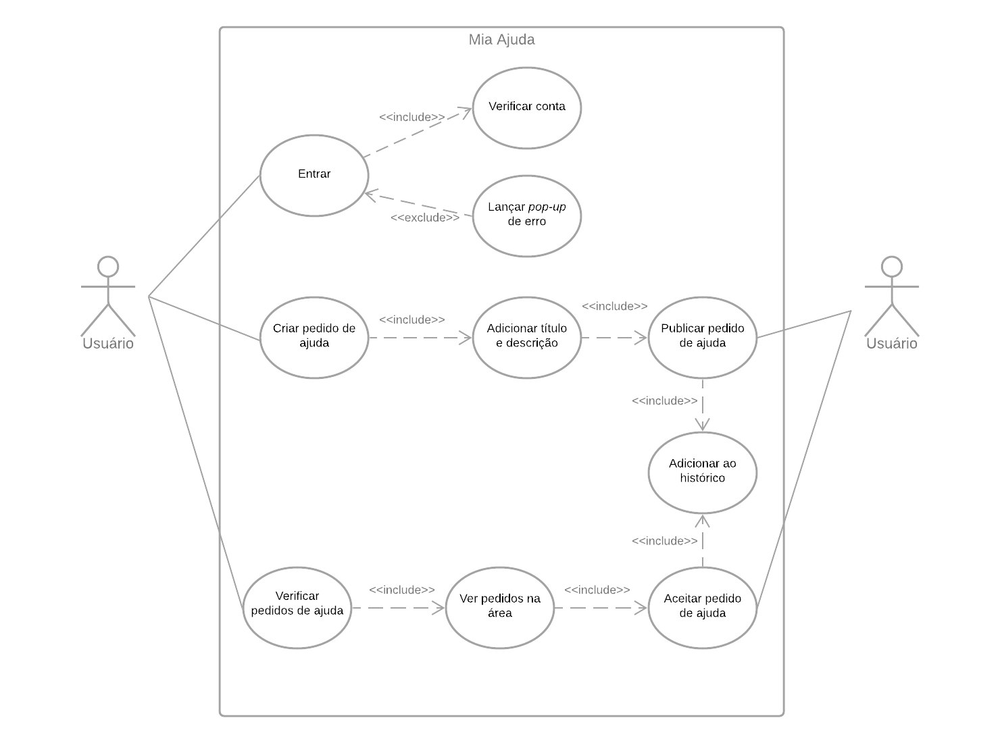

# Caso de Uso

O caso de uso é forma de modelagem que serve para ilustrar a ideia ou do software ou dos requisitos levantados, é uma ferramenta muito útil para podermos analisarmos de formar ilustrativa a ideia e o funcionamento do software, dessa forma fica mais claro como ele funciona, bem como possíveis erros que ele poderá ter. Essa ferramenta também é muito útil para se explicar à um cliente ou uma pessoa que não esteja envolvida na área de Tecnologia da Informação, o que torna esse método imprescindível para a parte de modelagem é o que foi supracitado antes que é a forma de se ilustrar ou criar um modelo físico do conceito e das ideias criadas do software.

# Use Case

### Versionamento

|Data|Versão|Descrição|Autor|
|:--------:|:---:|:-------------------: |:-----------------------:|
|06/10/2020| 0.1 | Criação do documento | Pedro Vítor de Salles Cella |