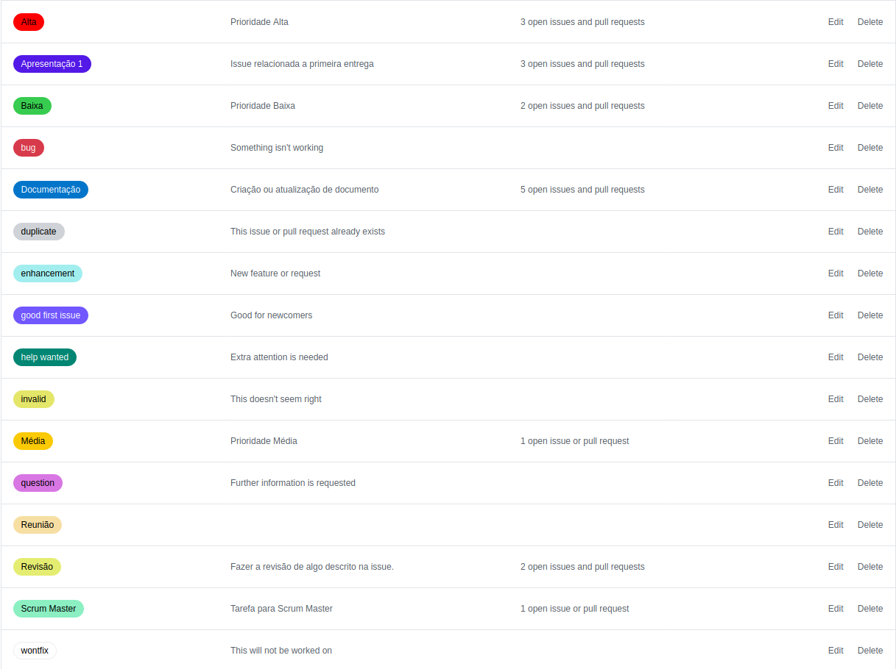

# Metodologia

A decisão do grupo foi a de utilizar uma metodologia ágil, visto que todos os membros têm experiência prévia com esse tipo de metodologia. Dessa forma é definido para os membros entregas semanais, essas entregas são feitas na reunião semanal, que além de marcar a data das entregas também indica o início de uma nova Sprint,bem como quais novas tarefas os membros estão encarregados. Utilizamos de issues para mostrar as tarefas a serem desenvolvidas, bem como labels que indicam que tipo de issue se trata.

## Regras para contribuição

Para poder contribuir no projeto deve-se seguir o padrão, previamente estabelecido, no documento de [Politicas](/pages/policy/policy). O documento sitado possui as normas de contribuição do projeto.

## Labels

Foram criadas novas labels além daquelas disponibilizadas pelo github, para que melhor se adequassem as issues.

## Reuniões

As reuniões acontecem uma vez por semana, sendo nela definida o começo de uma nova sprint assim como novas tarefas passadas aos membros, elas acontecem **nas terças-feiras às 16h**, porém caso algum dos membros precise que ela seja adiantada é enviado uma mensagem aos outros membros e verificado se todos tem a mesma disponibilidade.

|Data|Versão|Descrição|Autor|
|:-:|:-:|:-:|:-:|
|05/09/2020|0.1|Criação do documento de metodologia|Pedro Cella|
|06/09/2020|0.2|Revisão do arquivo e correção de tópicos|Danillo Souza|
