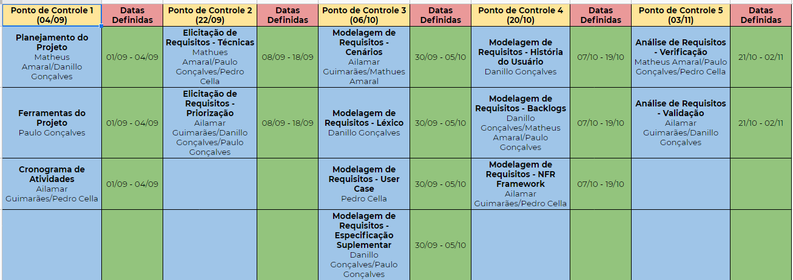

# Cronograma
O cronograma do projeto foi definido com base no plano de ensino, de acordo com as datas de entregas e os tópcos que devem ser desenvolvidos em cada apresentação, sendo assim estipulado os prazos e distribuição de atividades entre os integrantes. 

## Organização
Foi pensado em serem feitos pontos de controle entre o grupo. Esses planos de controle seriam realizados uma semana antes da entrega do trabalho, para que dessa forma sejam realizadas revisões do que foi feito pelos membros e se algum deles precisa de ajuda para terminar sua tarefa, ou seja, o ponto de controle serviria para analisar pequenos erros e problemas a serem resolvidos durante a semana restante para que não hajam imprevistos nas entregas do trabalho. 

## Etapas
Esse é um planejamento inicial e está sujeito a mudanças nas datas caso necessário.

---
|Data|Versão|Descrição|Autor|
|:--:|:----:|:-------:|:---:|
|06/09/2020|0.1|Criação do cronograma|Pedro Vítor de Salles Cella|
|06/09/2020|0.2|Revisão do cronograma e adição de tópicos|Ailamar Alves Guimarães|
|25/11/2020|0.3|Cronograma atualizado|Paulo Gonçalves Lima, Pedro Vitor de Salles Cella|
