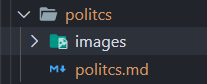

# Políticas

## Issues

### Nome

- Deve ser uma breve descrição da tarefa que será realizada.

### Descrição

- Deve ser clara e direta, o objetivo é informar somente o necessário para a realização da tarefa.

#### Critérios de aceitação

- Os critérios de aceitação da *issue* são o guia para que a issue seja finalizada.
- [ ] Critério A
- [ ] Critério B
- [ ] Critério C

- A *issue* só estará completa depois que todos os critérios de aceitação terem sido cumpridos.

### Atenção

- Toda *issue* deve ter, pelo menos, um membro como responsável pela mesma.

- As *issues* devem possuir *labels* que as identifiquem com a prioridade e também o tipo de trabalho que será realizado.

- A *issue* deve ser relacionada no **milestone** com a sua *sprint* ao decorrer do desenvolvimento.  

## Branches

- O nome da *branch* deve ser escrito em inglês, com o padrão *snake_case*, sem caracteres especiais e relacionado com o número da *issue*.


**Exemplo:**

```
    9_define_points
```

- Se houver a necessidade de uma branch de correção, o seu nome não terá o um número, mas a *tag* de *HotFix* seguida do erro que foi corrigido.

**Exemplo:**

```
    HotFix_grammar_error_archive_x
```

## Commits

- Os *commits* devem ser escrito em inglês e no passado, de preferência iniciados com um verbo, curtos e diretos, além de que devem ser relacionados com o número da issue.


**Exemplo:**

```
    git commit -m "[#9] Added topics definitions"
```

### Atenção

- Para adicionar múltiplos contribuidores em um *commit* deve apertar "Enter" duas vezes antes de finalizar as aspas:

```
    git commit -m "[#9] Added topics definitions

    Co-authored-By: Nome do ajudante1 <Email do ajudante1>
    Co-authored-By: Nome do ajudante2 <Email do ajudante2>"
```

## Pull Request

### Nome

- O *pull request* deve indicar em seu título o número e nome da issue, ao qual se refere.

### Descrição

- A descrição do *pull request* deve ser escrito de forma clara e objetiva. O que foi resolvido, quais issues foram resolvidas e quais eram os critérios de aceitação.

**Exemplo**

```
    Este pull request resolveu a issue#<NumeroDaIssue> de tal forma e os critérios de aceitação eram
    * Task A;
    * Task B;
    * ...
```

### Atenção

- O *pull request* só pode ser aceito depois que houver a revisão do mesmo.
- Indivíduos que participaram ativamente do desenvolvimento da *branch* não poderão revisar o *pull request*.

## Organização de Arquivos

### Nomes e Endereços

- Toda vez que for necessário criar um novo arquivo, crie uma pasta em:

```
    docs/pages/nomeDaPasta/nomeDoArquivo.md
```

- Todo arquivo e pasta novos seguirão o padrão *camelCase* e serão escritos em inglês.

### Imagens

- Se houver a necessidade de utilizar imagens, crie uma pasta *images* dentro da pasta que deseja utilizá-las.



```
    docs/pages/pastaDoMeuArquivoAtual/images
```

### Adicionar na wiki

- Para adicionar um novo documento na *Wiki* do projeto, deve-se adicionar o endereço do mesmo no arquivo:

```
    ./_sidebar.md
```

---
|Data|Versão|Descrição|Autor|
|:-:|:-:|:-:|:-:|
|05/09/2020|0.1|Criação do documento de políticas de contribuição|Danillo Souza|
|06/09/2020|0.2|Pequena mudança no padrão de nomes das branches|Paulo Gonçalves Lima|
