# Matriz Foward-Form

## Introdução

A rastreabilidade de requisitos pode ser vista como a habilidade de acompanhar e descrever a vida de um requisito, em ambas as direções.  
A técnica de Pós-Rastreabilidade Forward-Form visa ligar documentos obtidos no processo de elicitação no plano de negócio a requisitos relevantes, ou seja, ao usarmos o método de Forward-Form, vinculamos os requisitos a artefatos de desenho do sistema e sua implementação.  

## Metodologia

A metodologia escolhida para o desenvolvimento da matriz é a proposta de Toranzo para a rastreabilidade. As informações a serem rastreadas serão classificadas em quatro níveis: ambiental, organizacional, gerencial e desenvolvimento. Essa classificação é definida como:

- Ambiental: informações de contexto ambiental onde a organização está inserida e que podem afetar o sistema sendo desenvolvido;
- Organizacional: informações pertencentes à organização (missão, objetivos e estratégias);
- Gerencial: informações que auxiliam a gerência do projeto; e,
- Desenvolvimento: informações associadas aos diversos artefatos gerados ao longo do processo de desenvolvimento (artefatos de requisitos, diagramas, códigos, casos de teste e outros).  

Além disso, avaliamos também o suporte à rastreabilidade identificando os seguintes tipos de elos:

- Satisfação: classe origem tem dependência de satisfação com a classe
destino.
- Recurso: classe origem tem dependência de recurso com a classe
destino.
- Responsabilidade: registra a participação, responsabilidade e ação de
pessoas sobre artefatos.
- Representação: captura a representação ou modelagem dos requisitos
em outras linguagens.
- Alocado: classe origem está relacionada à classe destino, que
representa um subsistema.
- Agregação: indica “composição” de elementos.

## Matriz

### Legendas

|Sigla|Descrição|
|:-|:-|
|RF|Requisito Funcional|
|RNF|Requisito Não Funcional|
|EF|Elo Funcional|
|ENF|Elo Não Funcional|

 

### Forward-Form

|ID|Requisito|Cenários|Léxicos|Casos de Uso|Histórias de Usuários|Categoria|Elo
|:-:|:-:|:-|:-|:-|:-|:-|:-|
|RF-01|O usuário deve ser capaz de escolher sua localização no mapa| - | - | - | US02 | 
|RF-02|O usuário deve ser capaz de pedir ajuda para outros usuários| - C1; - C10;  - C11. | - Ajudas abertas; - Ajudas finalizadas; - Ajudas em Andamento. | [- Criar Pedido de Ajuda](https://requisitos-de-software.github.io/2020.1-Mia-Ajuda/#/pages/modeling/useCase/useCase?id=criar-pedido-de-ajuda)    | US02
|RF-03|O usuário deve ser capaz de oferecer ajuda a outros usuários|||
|RF-04|O usuário deve ser capaz de finalizar uma ajuda quando quiser|||
|RF-05|O usuário deve ser capaz de escolher o usuário que vai lhe ajudar|||
|RF-06|O usuário deve ser capaz de entrar em contato com o usuário que lhe ofereceu ajuda|||
|RF-07|O usuário deve ser capaz de finalizar um pedido de ajuda depois de ter sido ajudado|||
|RF-08|O usuário deve ser capaz de finalizar uma oferta de ajuda após ajudar um usuário|||
|RF-09|O usuário deve ser capaz de visualizar seus pedidos de ajuda|||
|RF-10|O usuário deve ser capaz de visualizar suas ofertas de ajuda|||
|RF-11|O usuário deve ser capaz de visualizar os pedidos de ajuda de outros usuários no mapa|||
|RF-12|O usuário deve ser capaz de dar um título ao pedido de ajuda|||
|RF-13|O usuário deve ser capaz de adicionar uma breve descrição ao pedido de ajuda|||
|RF-14|O usuário pode editar seu telefone|||
|RF-15|O usuário pode editar seu endereço|||
|RF-16|O usuário pode editar sua foto de perfil|||
|RF-17|O usuário deve ser capaz de logar e deslogar de sua conta quando quiser|||
|RNF-01|O usuário deve ser capaz de criar diversos pedidos de ajuda|||
|RNF-02|O usuário deve ser capaz de ver as informações básicas de quem lhe ofereceu ajuda|||
|RNF-03|O usuário deve ser capaz de visualizar seu histórico de ajudas|||
|RNF-04|O usuário deve ser capaz de trocar sua senha quando solicitado|||
|RNF-05|O usuário deve ser capaz de informar se faz parte do grupo de risco da COVID-19|||
|RNF-06|O usuário deve ser capaz de informar que é um profissional da saúde mental|||
|RNF-07|O usuário deve ser capaz de selecionar a categoria de sua ajuda para que a mesma possa ser filtrada por outros usuários|||
|RNF-08|O E-mail do usuário não pode se repetir|||
|RNF-09|O CPF do usuário não pode se repetir|||
|RNF-10|O usuário deve receber notificações quando tiver uma oferta de ajuda aceita|||
|RNF-11|O usuário deve ter um limite de pedidos de ajuda abertos simultaneamente|||
|RNF-12|O E-mail do usuário deve ser validado ao criar uma nova conta|||
|RNF-13|As ajudas do usuário devem ser apagadas depois de um tempo limite|||
|RNF-14|Um usuários só pode ajudar outros usuários que estiverem dentro do seu raio de distância|||
|RNF-15|Se deve avisar ao usuário caso o sistema esteja offline e ter uma estimativa de volta.|||

### Detalhamento

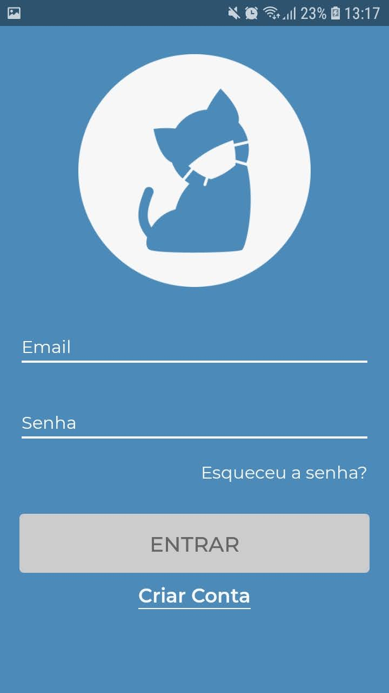
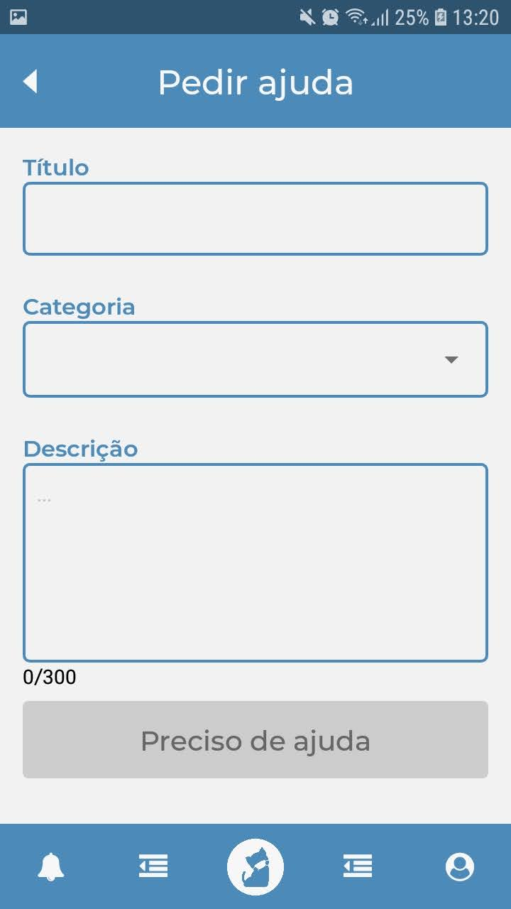
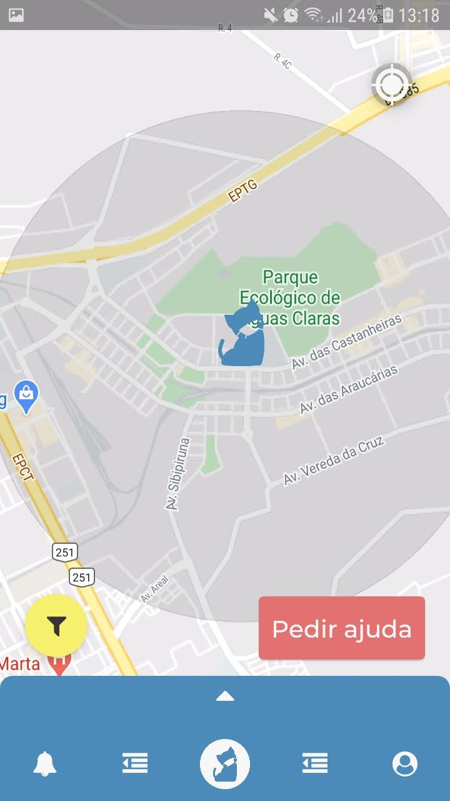
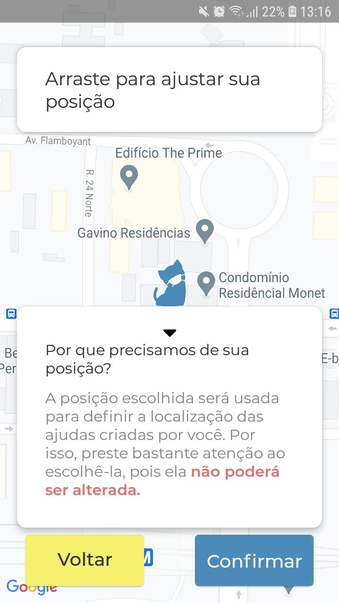
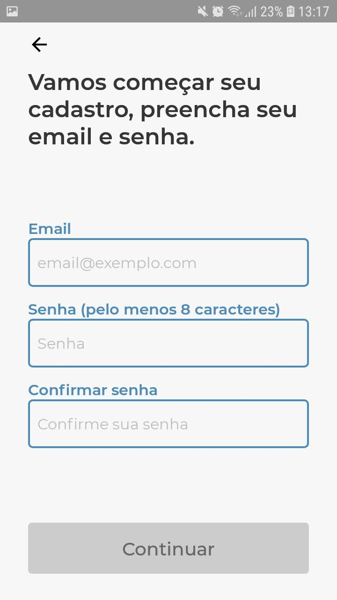
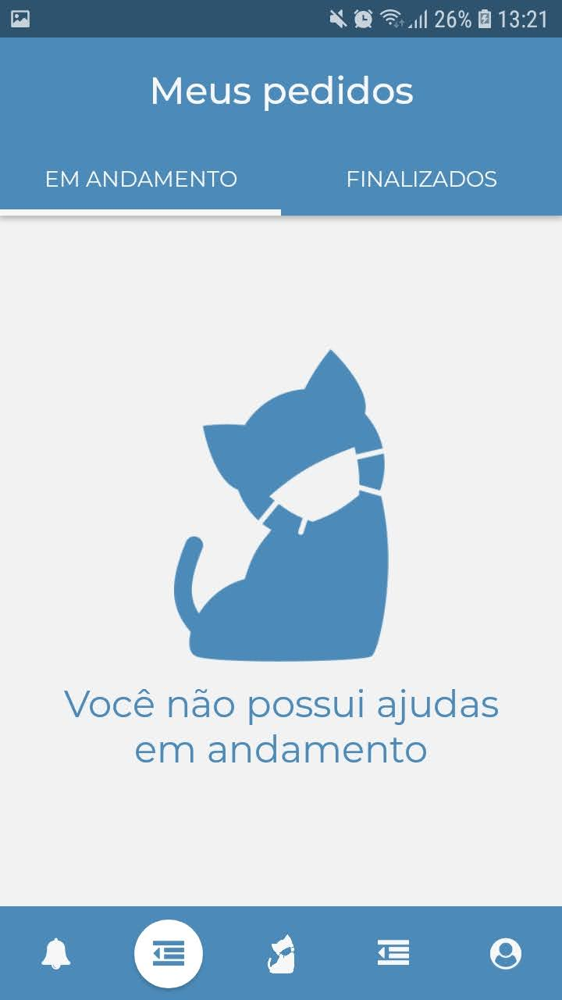
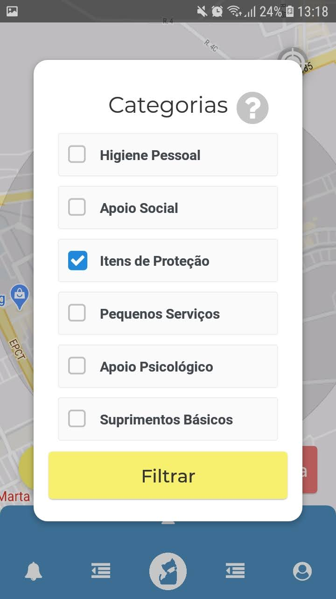
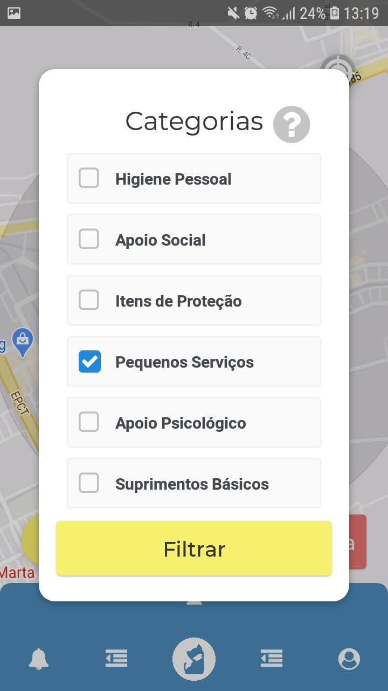

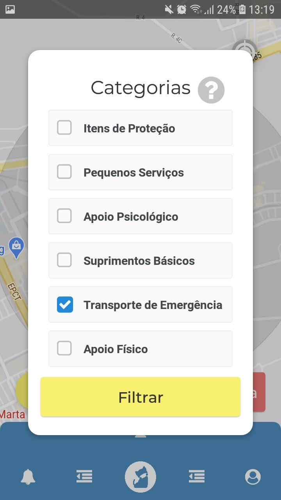
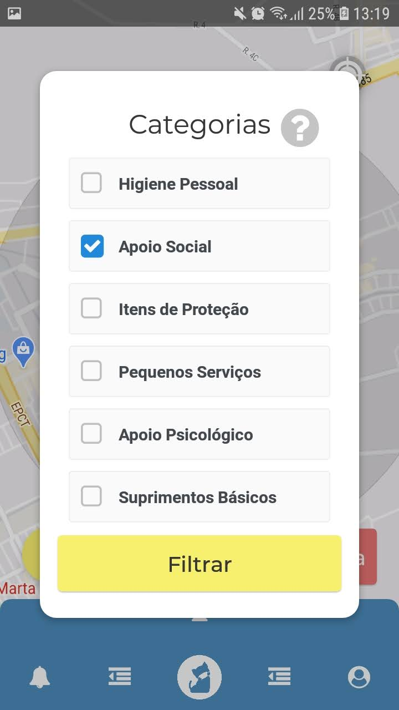
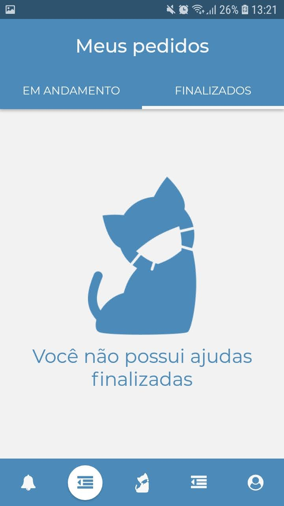
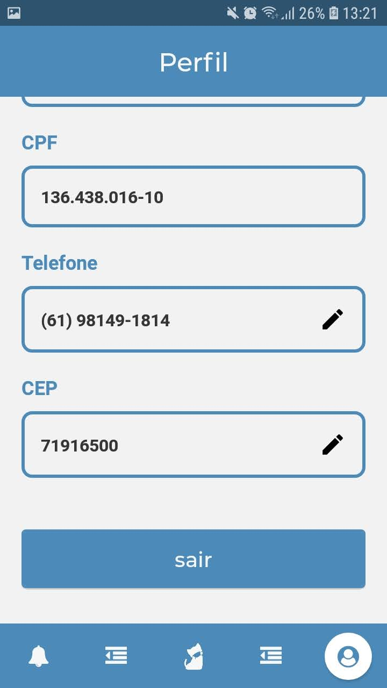
---

## Versionamento

|Data|Versão|Descrição|Autor|
|:-:|:-:|:-:|:-:|
|19/11/2020|0.1|Criação do documento|Pedro Vítor de Salles Cella|
|21/11/2020|0.2|Descrição dos tópicos de Introdução, Metodologia e Matriz|Ailamar Alves Guimarães|
|22/11/2020|0.3|Forward-Form versão 0.1|Ailamar Alves Guimarães|
|23/11/2020|0.4|Adição do detalhamento|Ailamar Alves Guimarães|

 

## Referências

- Requisitos - Aula 26. Milene Serrano e Maurício Serrano. Disponível em: <https://aprender3.unb.br/pluginfile.php/426777/mod_resource/content/1/Requisitos%20-%20Aula%20026.pdf> . Acesso em: nov, 2020.

- LSAYÃO, Miriam; DO PRADO LEITE, Julio Cesar Sampaio. Rastreabilidade de requisitos. RITA, v. 13, n. 1, p. 57-86, 2006. Disponível em: <http://www-di.inf.puc-rio.br/~julio/rastreabilidade5.pdf>. Acesso em: nov, 2020.

- Matriz Forward-From. Grupo Audible - 2019.2. Disponível em: <https://requisitos-de-software.github.io/2019.2-Audible/matrizforwardfrom/>. Acesso em: nov, 2020.
